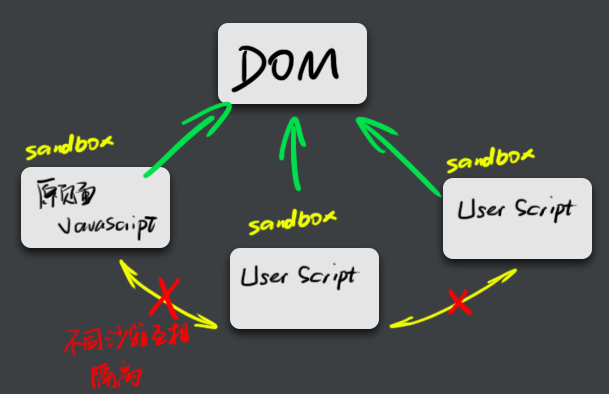

# Chrome User Scripts

****

** Chrome user scripts** 是可以被指定在特定的页面运行的脚本

用 JavaScript 编写

****


## 如何编写和使用

1. 写一个包含 **特殊注解** 的JavaScript 文件
2. 命名为 `<name>.user.js`
3. 拖拽到 [chrome://extensions/](chrome://extensions/) 页面，并确认
4. OK


****

## 编程相关

***

### 注解

```js
// ==UserScript==
// @match http://*/*
// @match http://*.google.com/*
// @match http://www.google.com/*
// ==/UserScript==
```

***

Chrome user scripts 不支持 `@require`，

如果你需要使用 jQuery，可以直接将整个 jQuery 的代码放到你的 .user.js 文件中

***

### User scripts 会在什么时候运行

1. 会在 Domready(?) 之后
2. 具体在什么时候，视页面加载情况而定

***

### 运行机制


